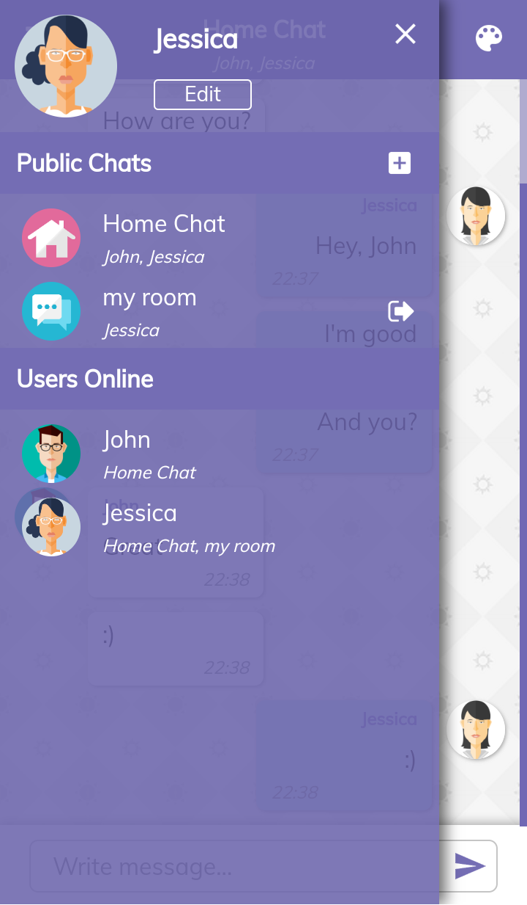
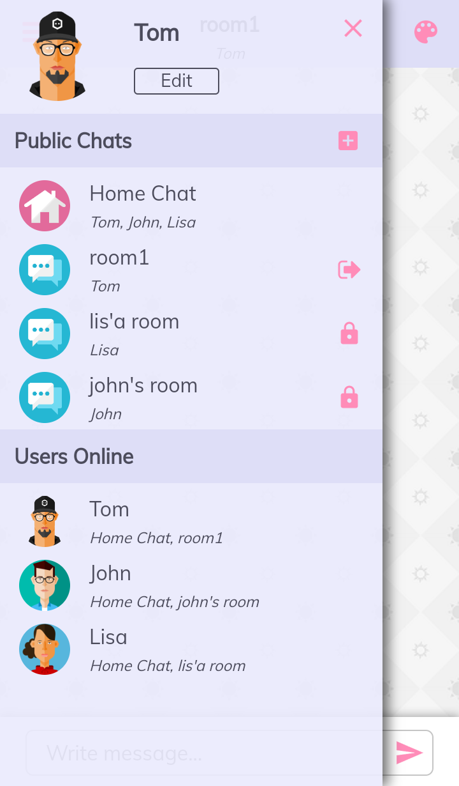
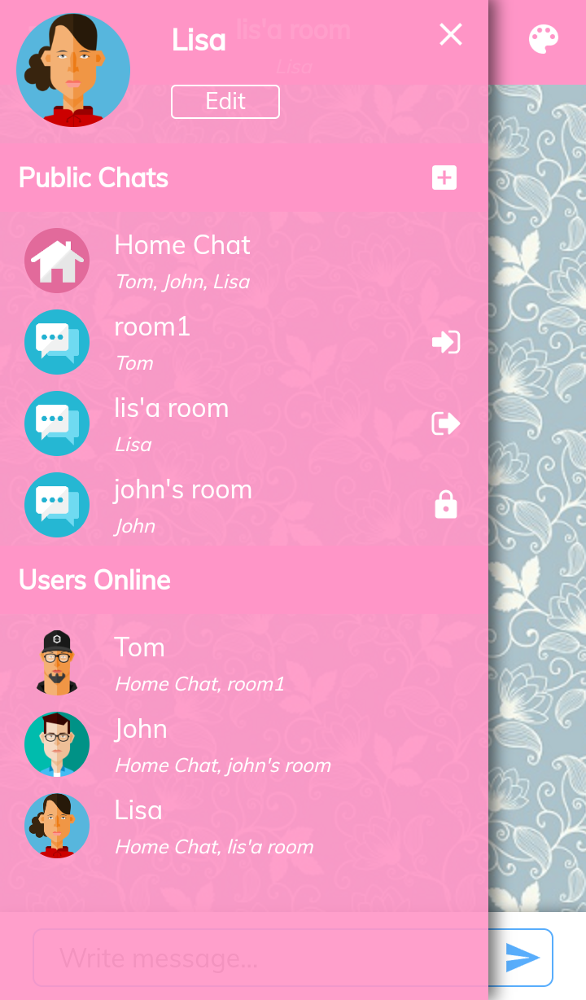
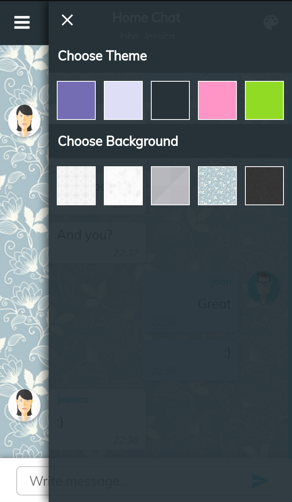
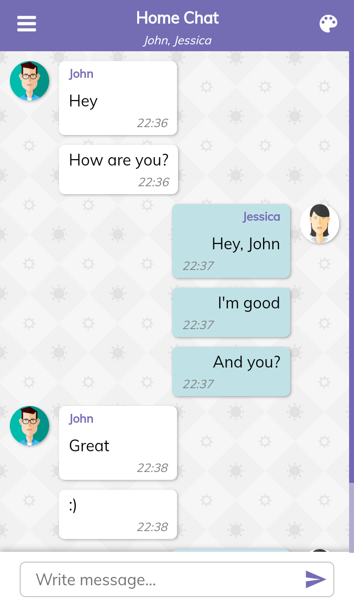
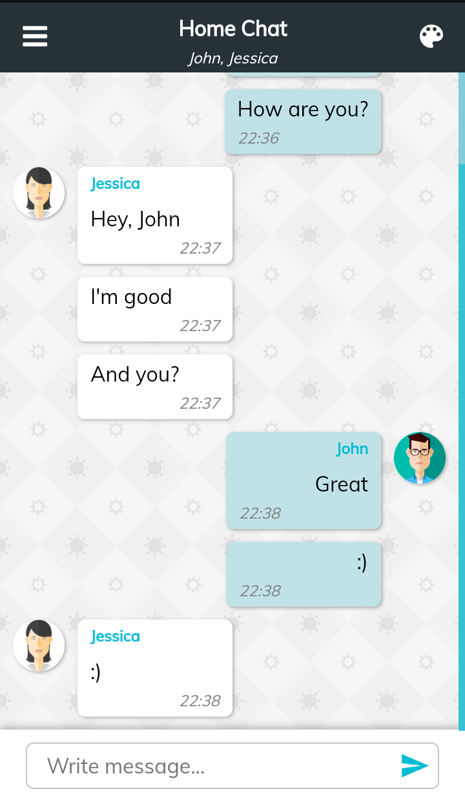

# Chat App

## Description
Chat application which allows user to send messages to other people. Works on desktop, tablets and smartphones.

You can see demo <a href="https://ij-chat-app.herokuapp.com/">here</a>.
### Features:
- Join  public group chat
- See the list of all chat rooms & users online
- Create own group chat (user can protect it with password)
- Chat with users in multiple rooms
- Set avatar
- Change color theme
- Change background
## Technologies & Tools
- React
- Express
- Socket.io
- Sass
- Webpack
- Axios
